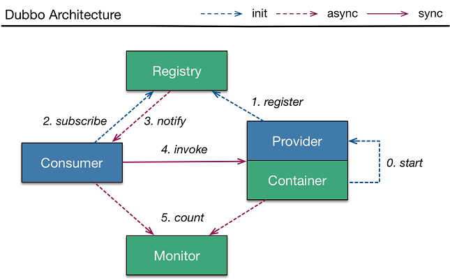

### dubbo + zookeeper 搭建分布式服务入门
dubbo是阿里开源的高性能RPC框架，框架图如下：<br>
<br>
可以分为4个部分，注册中心，消费者，提供者和监控中心，这也是一般分布式服务的常见架构。<br>
本文作为dubbo入门例子，采用zookeeper作为注册中心，可分为两个部分，如下：<br>
- **搭建zookeeper注册中心**
- **利用dubbo搭建分布式服务**

#### 搭建zookeeper注册中心
我们学习dubbo，可以在本机上搭建一个zookeeper注册中心，zookeeper在主流操作系统上都可以运行（windows，linux等）。需要注意的是**zookeeper是依赖jdk的，在安装zookeeper前先安装java。无论在windows还是linux**。<br>
##### 在windows上安装zookeeper
1、直接在官网下载zookeeper压缩包zookeeper-x.x.xx.tar.gz(x.x.xx是版本号),解压到本地文件夹。
2、修改conf文件夹下zoo_sample.cfg文件名为zoo.cfg，并将文件内容替换为下面：<br>
```
tickTime=2000
dataDir=/var/lib/zookeeper
clientPort=2181
```
这个也官网介绍的方法，以standalone方式安装zookeeper，官网地址：http://zookeeper.apache.org/doc/current/zookeeperStarted.html。<br>
3、启动bin文件下启动zkServer.cmd,可以用命令行启动，也可以直接启动。

##### 在ubuntu中安装zookeeper
在生产环境，很少会把zookeeper安装的windows下，所以为了学习更多linux相关知识，我在本机上装了一个虚拟机。<br>
1、安装virtualBox虚拟机软件。<br>
2、新建虚拟机，并安装ubuntu系统。<br>
3、用xsheel远程连接ubuntu，并把zookeeper压缩包上传至服务器，建议用root用户登录，一般用户远程连接，传输文件时经常没有权限被拒绝，ubuntu系统默认不支持root用户远程连接，需要修改配置，配置教程：https://www.cnblogs.com/TechSnail/p/7695090.html <br>
4、解压zookeeper文件。<br>
5、在/etc/profile文件中设置PATH。<br>
修改profile文件：指令 sudo vim /etc/profile，
```
export ZOOKEEPER_HOME=/xxx/xx/zookeeper-3.4.3
PATH=$ZOOKEEPER_HOME/bin:$PATH
export PATH
```
注意，ZOOKEEPER_HOME的值是解压zookeeper的路径。
6、启动zookeeper。<br>
指令：zkServer.sh start
查看状态:zkServer.sh status.<br>
注意：若在虚拟机中安装zookeeper，需要**修改虚拟机网络的配置（配置NAT转换和host-only网卡），添加端口映射**才能连接到虚拟机的zookeeper。<br>
到此，zookeeper服务注册中心已经搭建完毕，下面讲讲利用dubbo搭建分布式服务。<br>
#### 利用dubbo搭建分布式服务
本利为加深对分布式服务的理解，以一个学生信息（Student）的增删查为例进行讲解。<br>
服务端（提供者）实现对学生信息的插入，查询和删除三项操作。<br>
客户端（消费者）可以远程调用服务端接口，实现信息的操作。<br>
项目地址：https://github.com/xubaodian/dubbo-study ,可下载参考<br>
项目结构如下:
<br>
简单介绍下工程结构，这是一个maven工程，包括三个模块（module）,分别为consumer(消费者、客户端),demoapi(都依赖的一些接口和实体类)和provider(服务提供者、服务端)。<br>
最外层pom依赖进行依赖管理，把本项目所有的依赖都添加进来.<br>
注意：**各项依赖之间存在隐性依赖，可能会产生冲突，利用  <exclusions>标签消除依赖冲突，具体可百度。**
``` pom
<?xml version="1.0" encoding="UTF-8"?>
<project xmlns="http://maven.apache.org/POM/4.0.0"
         xmlns:xsi="http://www.w3.org/2001/XMLSchema-instance"
         xsi:schemaLocation="http://maven.apache.org/POM/4.0.0 http://maven.apache.org/xsd/maven-4.0.0.xsd">
    <modelVersion>4.0.0</modelVersion>

    <groupId>com.xbd</groupId>
    <artifactId>dubbo-study</artifactId>
    <packaging>pom</packaging>
    <version>1.0-SNAPSHOT</version>
    <modules>
        <module>provider</module>
        <module>demoapi</module>
        <module>consumer</module>
    </modules>
    <properties>
        <junit.version>4.11</junit.version>
        <spring.version>4.3.16.RELEASE</spring.version>
        <slf4j.version>1.6.4</slf4j.version>
        <dubbo.version>2.6.2</dubbo.version>
        <zk.version>3.4.10</zk.version>
        <log4j.version>1.2.17</log4j.version>
    </properties>
    <dependencyManagement>
        <dependencies>
            <dependency>
                <groupId>com.alibaba</groupId>
                <artifactId>dubbo</artifactId>
                <version>${dubbo.version}</version>
                <exclusions>
                    <exclusion>
                        <groupId>org.springframework</groupId>
                        <artifactId>spring</artifactId>
                    </exclusion>
                </exclusions>
            </dependency>
            <dependency>
                <groupId>junit</groupId>
                <artifactId>junit</artifactId>
                <version>${junit.version}</version>
                <scope>test</scope>
            </dependency>
            <dependency>
                <groupId>org.apache.zookeeper</groupId>
                <artifactId>zookeeper</artifactId>
                <version>${zk.version}</version>
            </dependency>
            <!--日志依赖-->
            <dependency>
                <groupId>log4j</groupId>
                <artifactId>log4j</artifactId>
                <version>${log4j.version}</version>
            </dependency>
            <!-- spring相关 -->
            <dependency>
                <groupId>org.springframework</groupId>
                <artifactId>spring-core</artifactId>
                <version>${spring.version}</version>
            </dependency>
            <dependency>
                <groupId>org.springframework</groupId>
                <artifactId>spring-beans</artifactId>
                <version>${spring.version}</version>
            </dependency>
            <dependency>
                <groupId>org.springframework</groupId>
                <artifactId>spring-context</artifactId>
                <version>${spring.version}</version>
            </dependency>
            <dependency>
                <groupId>org.springframework</groupId>
                <artifactId>spring-jdbc</artifactId>
                <version>${spring.version}</version>
            </dependency>
            <dependency>
                <groupId>org.springframework</groupId>
                <artifactId>spring-web</artifactId>
                <version>${spring.version}</version>
            </dependency>
            <dependency>
                <groupId>org.springframework</groupId>
                <artifactId>spring-webmvc</artifactId>
                <version>${spring.version}</version>
            </dependency>
            <dependency>
                <groupId>org.springframework</groupId>
                <artifactId>spring-aop</artifactId>
                <version>${spring.version}</version>
            </dependency>
            <dependency>
                <groupId>org.springframework</groupId>
                <artifactId>spring-tx</artifactId>
                <version>${spring.version}</version>
            </dependency>
            <dependency>
                <groupId>org.springframework</groupId>
                <artifactId>spring-orm</artifactId>
                <version>${spring.version}</version>
            </dependency>
            <dependency>
                <groupId>org.springframework</groupId>
                <artifactId>spring-context-support</artifactId>
                <version>${spring.version}</version>
            </dependency>
            <dependency>
                <groupId>org.springframework</groupId>
                <artifactId>spring-test</artifactId>
                <version>${spring.version}</version>
            </dependency>
            <dependency>
                <groupId>org.springframework</groupId>
                <artifactId>spring-jms</artifactId>
                <version>${spring.version}</version>
            </dependency>
            <dependency>
                <groupId>org.aspectj</groupId>
                <artifactId>aspectjrt</artifactId>
                <version>1.6.11</version>
            </dependency>
            <dependency>
                <groupId>org.aspectj</groupId>
                <artifactId>aspectjweaver</artifactId>
                <version>1.6.11</version>
            </dependency>
            <dependency>
                <groupId>org.apache.curator</groupId>
                <artifactId>curator-recipes</artifactId>
                <version>2.4.2</version>
                <exclusions>
                    <exclusion>
                        <groupId>org.apache.zookeeper</groupId>
                        <artifactId>zookeeper</artifactId>
                    </exclusion>
                </exclusions>
            </dependency>
        </dependencies>
    </dependencyManagement>
</project>
```
按顺序介绍三个模块
##### demoapi模块
该模块包括两个实体类和一个接口，实体类分别是Student.java学生信息类，RetMessage操作信息类，提示消费者操作是否成功及操作失败原因。<br>
一个接口DemoApi.java，提供学生信息增删改接口。
```java
//学生信息实体类
package com.xbd.demoapi.entity;
import java.io.Serializable;

public class Student implements Serializable {
    private static final long serialVersionUID = 0L;
    private String stuId;
    private String name;
    private int age;
    private int grade;

    public String getStuId() {
        return stuId;
    }

    public void setStuId(String stuId) {
        this.stuId = stuId;
    }

    public String getName() {
        return name;
    }

    public void setName(String name) {
        this.name = name;
    }

    public int getAge() {
        return age;
    }

    public void setAge(int age) {
        this.age = age;
    }

    public int getGrade() {
        return grade;
    }

    public void setGrade(int grade) {
        this.grade = grade;
    }
}
//RetMessage操作信息类
package com.xbd.demoapi.entity;

import java.io.Serializable;

public class RetMessage implements Serializable {
    private static final long serialVersionUID = 1L;
    private boolean success;
    private String message;

    public boolean isSuccess() {
        return success;
    }

    public void setSuccess(boolean success) {
        this.success = success;
    }

    public String getMessage() {
        return message;
    }

    public void setMessage(String message) {
        this.message = message;
    }
}

//DemoApi接口
package com.xbd.demoapi.service;

import com.xbd.demoapi.entity.RetMessage;
import com.xbd.demoapi.entity.Student;

public interface DemoApi {
    public Student getInfoById(String Id);
    public RetMessage insertInfo(Student stu);
    public RetMessage deleteById(String Id);
}

```
##### provider模块
该模块依赖我就不多说了，主要介绍下spring配置文件，dubbo-provider.xml，该文件内容如下，各个语句都有注释：
``` xml
<beans xmlns="http://www.springframework.org/schema/beans"
       xmlns:xsi="http://www.w3.org/2001/XMLSchema-instance"
       xmlns:dubbo="http://dubbo.apache.org/schema/dubbo"
       xsi:schemaLocation="http://www.springframework.org/schema/beans
       http://www.springframework.org/schema/beans/spring-beans-4.3.xsd
       http://dubbo.apache.org/schema/dubbo
       http://dubbo.apache.org/schema/dubbo/dubbo.xsd">

    <!-- provider's application name, used for tracing dependency relationship -->
    <!--服务提供者名称-->
    <dubbo:application name="provider"/>

    <!-- use multicast registry center to export service -->
    <!-- <dubbo:registry protocol="zookeeper" address="localhost:2181"/>-->
    <!--zookeeper注册中心地址-->
    <dubbo:registry protocol="zookeeper" address="zookeeper://192.168.56.10:10000"/>

    <!-- use dubbo protocol to export service on port 20880 -->
    <!--服务名称和端口号-->
    <dubbo:protocol name="dubbo" port="20880"/>

    <!-- service implementation, as same as regular local bean -->
    <!--接口的执行类-->
    <bean id="demoService" class="com.xbd.provider.DemoApiImpl"/>

    <!-- declare the service interface to be exported -->
    <!--声明接口-->
    <dubbo:service interface="com.xbd.demoapi.service.DemoApi" ref="demoService"/>

</beans>

```
服务实现类为DemoApiImpl.java，如下，注释解释了各个接口的意义
